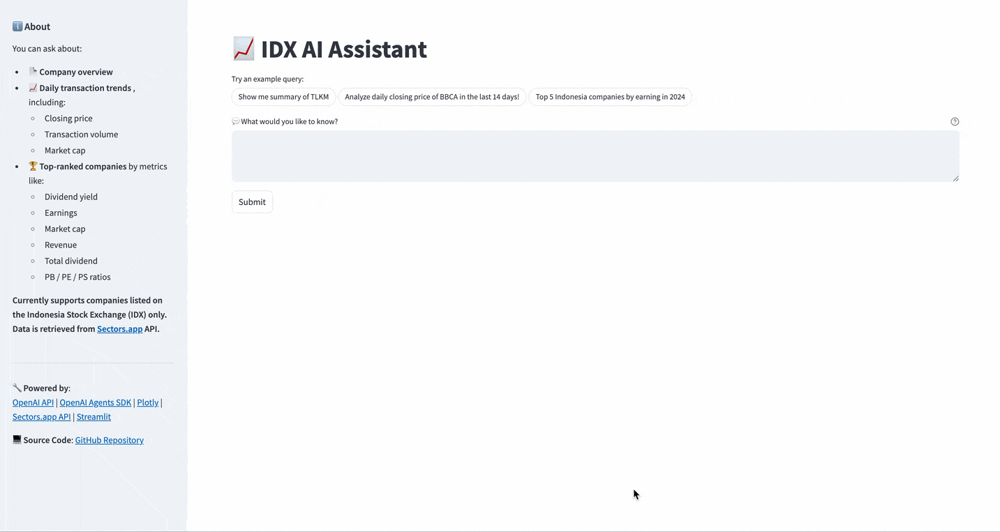

# agentic-ai

A personal learning project focused on building **Agentic AI systems** using the **OpenAI Agents SDK**. This repository showcases an interactive financial analytics application that combines **multi-agent coordination**, **retrieval-augmented generation (RAG)**, and **natural language interfaces**.

Try the app here! 
[IDX AI Assistant](https://idx-ai-assistant-miqbalrp-v2.streamlit.app/) 

---

## Project Overview

This app demonstrates a modular agent-based workflow:

- 🧭 **Orchestrator Agent**: Understands user questions and manages sub-agents.
- 🧾 **Company Overview Agent**: Generates a narrative report of a company in IDX.
- 📊 **Trend Analyst Agent**: Uses a tool to pull real financial data via API and generate the analysis of the trend with visualization.
- and more (see learning milestone for detail)



All agents are orchestrated using the [OpenAI Agents SDK](https://platform.openai.com/docs/assistants/overview), which provides a structured and extensible framework for building LLM-driven applications.

## Key Features

- 🧠 Multi-agent coordination via OpenAI Agents SDK
- 📈 Real-time financial data retrieval from Sectors.app using API-based RAG
- 🗣️ Natural language interface for user queries
- 📊 Interactive data visualization with Plotly
- 🧪 Built with Streamlit for fast prototyping

---

## Tech Stack

- [OpenAI Agents SDK](https://platform.openai.com/docs/assistants/overview)
- [OpenAI API](https://platform.openai.com/)
- [Sectors.app API](https://sectors.app)
- [Streamlit](https://streamlit.io/)
- [Plotly](https://plotly.com/python/)

  ---

## Getting Started

1. **Clone the repo**
   ```bash
   git clone https://github.com/miqbalrp/agentic-ai.git
   cd agentic-ai
2. **Set up your environment**
   ```bash
   python -m venv venv
   source venv/bin/activate      # On Windows: venv\Scripts\activate
   pip install -r requirements.txt
3. **Configure your environment variables**
   Create a .env file (or .streamlit/secrets.toml) with:
   ```bash
   OPENAI_API_KEY=your_openai_key_here
   SECTORS_API_KEY=your_sectors_app_key_here
4. **Run the app**
   ```bash
   streamlit run app.py

## Inspiration
This project was inspired by the Agentic Patterns Workshop organized by Supertype. The hands-on session introduced practical techniques for building agent-based applications using modern LLMs and retrieval-augmented generation (RAG). The workshop and its accompanying course material — available at sectors.app/bulletin/agentic-patterns — provided the foundational ideas that sparked the development of this financial analytics app. 

## 🚀 Learning Milestones
### 📅 [2025-06-09] — Foundation: Multi-Agent System v1
For the first version of the app, I implemented several core concepts in Multi-Agent System development:

- **Tool Use, Function Calling, and API-based Retrieval-Augmented Generation (RAG):**  
  I used the `function_tool` decorator from the OpenAI Agents SDK to integrate real-time data via API calls. The app pulls live IDX stock data from the [Sectors.app API](https://sectors.app), ensuring that the model does not hallucinate or rely on outdated training data.

- **Handoff & Delegation Pattern:**  
  To orchestrate task routing, I built a `triage_agent` responsible for interpreting user queries and delegating them to the appropriate specialized agent.


- **Pydantic-Based Data Validation:**  
  I learned that even though agents are powerful, it's crucial to validate outputs to ensure consistency and reliability in the orchestration pipeline. I used Pydantic models to enforce strict schemas, which also made integration with Streamlit smoother and more predictable.

- **Combined Text + Visualization Reports:**  
  Agents like `trend_analysis_agent` and `top_companies_agent` not only generate text summaries but also return structured data for Plotly charts. This dual-output design required strong validation to ensure data and narrative were aligned.

---

### 📅 [2025-06-12] — Evolving to Agent-as-Tool Architecture
In version 2 of the app, I transitioned from a handoff pattern to the more flexible **agent-as-tool** concept (as implemented in `orchestrator_agent.py`).

- This shift allows multiple agents to work together on a single query instead of passing responsibility to just one.  
- For example, a query like *"Summarize TLKM and show its daily closing trend"* would trigger **both** `company_overview_agent` and `trend_analysis_agent`, with the `orchestrator_agent` coordinating their execution and combining the results.


*Note*: for reference, I keep the previous version of app that using `triage_agent` in `legacy/app_v1.py`

---

### 📅 [2025-06-27] — Handling Input Schema in Tool-Agents
While using `agent.as_tool` is convenient, I discovered a limitation: you can't explicitly define input schemas per tool using that approach.

- Without input constraints, some important context could be dropped.
- To resolve this, I used `Runner.run()` to define strict input parameters for each agent, following guidance from the [OpenAI Agents SDK documentation](https://openai.github.io/openai-agents-python/tools/#customizing-tool-agents).

This change improved reliability and ensured that each tool-agent receives the exact input it expects.

---

### 📅 [2025-06-29] — Guardrails for Safer AI Use
To ensure the app remains compliant and focused, I implemented an **Input Guardrail** system to filter unsupported or inappropriate queries:

- ❌ Block queries about companies **not listed on IDX**
- ⚠️ Reject queries containing **non-compliant language or topics**

This input filtering ensures the assistant stays within its intended scope and upholds data integrity and compliance standards.

---

### 📅 [2025-07-05] — Planner & Executor Pattern for Multi-Step Queries

The current orchestration pattern struggled with **multi-step queries**, often returning partial or inconsistent results.

For example:
> "Find the top 3 companies by revenue and show their trend lines."

The app correctly identified the top companies, but then **randomly selected tickers** when generating trend lines.

To address this, I refactored the architecture by introducing a **Planner–Executor pattern**:

- 🧠 `planner_agent`: interprets the full query and breaks it into sub-tasks
- 🛠️ `executor_agent`: handles each sub-task using the appropriate tool-agent

This change improves consistency and ensures that **intermediate results are preserved** and passed forward correctly.

---

### 📅 [2025-07-08] — Chat Mode for Conversational Interaction

After exploring core Agentic AI concepts, the app now supports a **Chat Mode**, enabling users to interact conversationally—similar to LLM apps like ChatGPT or Gemini—but focused exclusively on **IDX-listed companies**.

Thanks to **Streamlit's Chat Elements** ([docs](https://docs.streamlit.io/develop/api-reference/chat)), this feature was straightforward to implement:

- 💬 Used `st.session_state` to persist multi-turn conversation
- 📊 Maintained structured output to ensure **Plotly** plots render correctly across chat history
- 🧭 Introduced `chat_triage_agent` to handle general conversational inputs (e.g. greetings, feature inquiries)  
  - These messages bypass `InputGuardrail`
  - If a query relates to IDX companies, it’s **delegated to `orchestrator_agent`**

This upgrade makes the assistant more natural and accessible to users.  
🔜 **Next milestone:** implementing **streaming output** for a more responsive experience.


---

*This project is part of my ongoing journey into practical Agentic AI — suggestions and contributions are welcome!*
